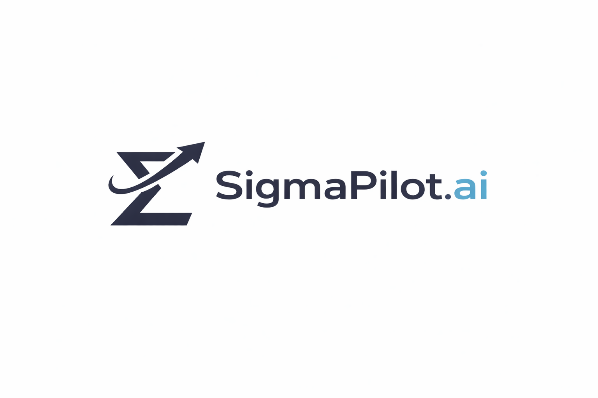

<p align="center">
  
</p>

# SigmaPilot MCP Server

A remote Model Context Protocol (MCP) server that provides real-time cryptocurrency and stock market analysis. AI-powered market intelligence tools deployable to Railway with Auth0 authentication for secure access.

## Features

### Market Scanners
- **Top Gainers/Losers Scanner** - Find best and worst performing assets across exchanges
- **Bollinger Scanner** - Detect squeeze patterns for potential breakouts
- **Rating Scanner** - Filter assets by Bollinger Band position (-3 to +3 rating)
- **Volume Scanner** - Find high-volume breakouts with RSI filtering
- **Pivot Points Scanner** - Find assets near key pivot levels

### Basic Technical Analysis
- **Basic TA Analyzer** - Comprehensive indicator snapshot with volume analysis

### Theory-Based Analysis Engines (v2.0 Analyzers)
- **Dow Theory Analyzer** - Primary trend identification with higher highs/lows analysis
- **Ichimoku Analyzer** - Cloud analysis, TK crosses, trend confirmation
- **VSA Analyzer** - Volume Spread Analysis (smart money signals)
- **Chart Pattern Analyzer** - Classical patterns (Head & Shoulders, Double Top/Bottom, etc.)
- **Wyckoff Analyzer** - Accumulation/Distribution phase detection
- **Elliott Wave Analyzer** - Wave pattern identification and counting
- **Chan Theory Analyzer** - Fractal and stroke analysis (缠论)
- **Harmonic Analyzer** - Gartley, Bat, Butterfly, Crab patterns
- **Market Profile Analyzer** - Value Area, POC, profile shape analysis

### Technical Indicators
- **Bollinger Bands** - BBW, position, rating, squeeze detection
- **Moving Averages** - SMA (5, 10, 20, 30, 50, 100, 200), EMA (5, 9, 10, 21, 30, 50, 100, 200), Hull MA, VWMA
- **Ichimoku Cloud** - Tenkan-sen, Kijun-sen, Senkou Span A/B, TK Cross signals
- **Pivot Points** - Classic, Fibonacci, Camarilla (R1-R3, S1-S3)
- **Oscillators** - RSI, Stochastic, Williams %R, CCI, Ultimate Oscillator, Awesome Oscillator
- **Trend** - MACD, ADX, Parabolic SAR, Momentum
- **Volume** - VWAP, Volume analysis
- **Recommendations** - Overall, MA-based, Oscillator-based signals
- ATR (Average True Range)

### Supported Markets

| Market Type | Exchanges |
|-------------|-----------|
| Crypto | KuCoin, Binance, Bybit, Bitget, OKX, Coinbase, Gate.io, Huobi, Bitfinex |
| US Stocks | NASDAQ, NYSE |
| Turkish Stocks | BIST |
| Malaysian Stocks | Bursa, KLSE, ACE, LEAP |
| Hong Kong Stocks | HKEX, HSI |

### Timeframes
`5m` `15m` `1h` `4h` `1D` `1W` `1M`

## Quick Start

### Option 1: Remote Deployment (Recommended)

Deploy as a secure remote MCP server with Auth0 authentication. Once deployed, connect from **any MCP-compatible AI platform**:
- **Claude.ai** - Via [Connectors](https://claude.ai/settings/connectors) ([documentation](https://support.claude.com/en/articles/11724452-using-the-connectors-directory-to-extend-claude-s-capabilities))
- **ChatGPT** - Via MCP plugin support
- **Other AI platforms** - Any service supporting MCP protocol

#### Prerequisites
- [Railway account](https://railway.app/) (free tier available)
- [Auth0 account](https://auth0.com/) (free tier available)
- GitHub account

#### Deploy Steps

1. **Fork/Clone this repository to GitHub**

2. **Set up Auth0**
   - Create account at [auth0.com](https://auth0.com)
   - Create API: Dashboard > Applications > APIs > Create API
   - Note your `Domain` and `API Identifier`

3. **Deploy to Railway**
   - Connect your GitHub repo to Railway
   - Add environment variables:
     ```
     AUTH0_DOMAIN=your-tenant.auth0.com
     AUTH0_AUDIENCE=https://your-api-identifier
     RESOURCE_SERVER_URL=https://your-app.up.railway.app/mcp
     ```

4. **Connect to AI Platform**

   **Claude.ai (Web):**
   - Go to [claude.ai/settings/connectors](https://claude.ai/settings/connectors)
   - Add your MCP server URL: `https://your-app.up.railway.app/mcp`
   - Authenticate with Auth0 when prompted

   **Claude Desktop:**
   ```json
   {
     "mcpServers": {
       "sigmapilot": {
         "url": "https://your-app.up.railway.app/mcp",
         "transport": "streamable-http"
       }
     }
   }
   ```

See [Remote Deployment Guide](docs/REMOTE_DEPLOYMENT.md) for detailed instructions.

### Option 2: Local Installation

For local development or direct Claude Desktop connection (stdio mode).

1. **Install UV Package Manager:**
   ```bash
   # macOS
   brew install uv

   # Windows
   powershell -ExecutionPolicy ByPass -c "irm https://astral.sh/uv/install.ps1 | iex"

   # Linux
   curl -LsSf https://astral.sh/uv/install.sh | sh
   ```

2. **Add to Claude Desktop config:**

   Config location:
   - Windows: `%APPDATA%\Claude\claude_desktop_config.json`
   - macOS: `~/Library/Application Support/Claude/claude_desktop_config.json`

   ```json
   {
     "mcpServers": {
       "sigmapilot-mcp": {
         "command": "uv",
         "args": [
           "tool", "run", "--from",
           "git+https://github.com/fzheng/sigmapilot-mcp.git",
           "sigmapilot-mcp"
         ]
       }
     }
   }
   ```

3. **Restart Claude Desktop**

## Available Tools (16 Total)

### Market Scanners (6)

| Tool | Description |
|------|-------------|
| `top_gainers_scanner` | Top performing assets by exchange/timeframe |
| `top_losers_scanner` | Worst performing assets by exchange/timeframe |
| `bollinger_scanner` | Find assets with Bollinger Band squeeze |
| `rating_scanner` | Filter by BB rating (-3 to +3) |
| `volume_scanner` | Volume breakout detection with RSI filtering |
| `pivot_points_scanner` | Find coins near pivot point levels (Classic/Fibonacci/Camarilla) |

### Analyzers (10)

| Tool | Description |
|------|-------------|
| `basic_ta_analyzer` | Basic technical analysis snapshot (indicators + volume analysis) |
| `dow_theory_analyzer` | Analyze trends using Dow Theory (higher highs/lows) |
| `ichimoku_analyzer` | Ichimoku Kinko Hyo analysis (cloud, TK cross, Chikou) |
| `vsa_analyzer` | Volume Spread Analysis (smart money signals) |
| `chart_pattern_analyzer` | Classical chart patterns (H&S, triangles, double top/bottom) |
| `wyckoff_analyzer` | Wyckoff phases (accumulation, distribution, markup, markdown) |
| `elliott_wave_analyzer` | Elliott Wave pattern analysis (impulse/corrective) |
| `chan_theory_analyzer` | Chan Theory/Chanlun (fractals, strokes, segments, hubs) |
| `harmonic_analyzer` | Harmonic patterns (Gartley, Bat, Butterfly, Crab) |
| `market_profile_analyzer` | Market Profile (POC, Value Area, profile shape) |

## Bollinger Band Rating System

| Rating | Meaning | Signal |
|--------|---------|--------|
| +3 | Above upper band | Strong momentum (may be overbought) |
| +2 | Upper 50% of bands | BUY |
| +1 | Above middle line | Weak bullish |
| 0 | At middle line | NEUTRAL |
| -1 | Below middle line | Weak bearish |
| -2 | Lower 50% of bands | SELL |
| -3 | Below lower band | Strong momentum (may be oversold) |

## Example Queries

```
"Show me top 10 crypto gainers on KuCoin in 15 minutes"
"Find coins with Bollinger Band squeeze on Binance"
"Analyze BTCUSDT with basic technical indicators"
"Show volume breakouts on Bybit"
"Analyze ETHUSDT using Dow Theory"
"Check Ichimoku signals for BTCUSDT on the daily timeframe"
"Find Wyckoff accumulation patterns on SOLUSDT"
"Detect harmonic patterns on BTCUSDT 4h chart"
```

## Development

```bash
# Clone and install
git clone https://github.com/fzheng/sigmapilot-mcp.git
cd sigmapilot-mcp
uv sync

# Run tests
make test

# Run locally (stdio mode for Claude Desktop)
uv run python src/sigmapilot_mcp/server.py

# Run as HTTP server (development mode, no auth)
uv run python src/sigmapilot_mcp/server.py streamable-http --port 8000

# Run as HTTP server with Auth0 authentication
AUTH0_DOMAIN=your-tenant.auth0.com AUTH0_AUDIENCE=https://your-api \
  uv run python src/sigmapilot_mcp/server.py streamable-http --auth
```

## Architecture

The server supports two modes:

### stdio Mode (Claude Desktop)
```
┌─────────────────┐      stdio       ┌─────────────────┐
│ Claude Desktop  │ ◄──────────────► │   server.py     │
└─────────────────┘                  └────────┬────────┘
                                              │
                                              ▼
                                     ┌─────────────────┐
                                     │  TradingView    │
                                     │  Market APIs    │
                                     └─────────────────┘
```

### HTTP Mode (Remote/Railway)
```
┌─────────────────┐      HTTPS       ┌─────────────────┐
│   Claude.ai     │ ───────────────► │ Railway Server  │
│   ChatGPT       │  + OAuth Token   │  (server.py)    │
│   AI Platforms  │                  └────────┬────────┘
└─────────────────┘                           │
                                              ▼
                                     ┌─────────────────┐
                                     │    Auth0        │
                                     │  Token Verify   │
                                     └────────┬────────┘
                                              │
                                              ▼
                                     ┌─────────────────┐
                                     │  TradingView    │
                                     │  Market APIs    │
                                     └─────────────────┘
```

## Documentation

- [Remote Deployment Guide](docs/REMOTE_DEPLOYMENT.md)
- [Installation Guide](docs/INSTALLATION.md)
- [Usage Examples](docs/EXAMPLES.md)
- [Contributing](docs/CONTRIBUTING.md)
- [Development TODO](docs/TODO.md)

## License

MIT License - see [LICENSE](LICENSE)

## Support

- [GitHub Issues](https://github.com/fzheng/sigmapilot-mcp/issues)
